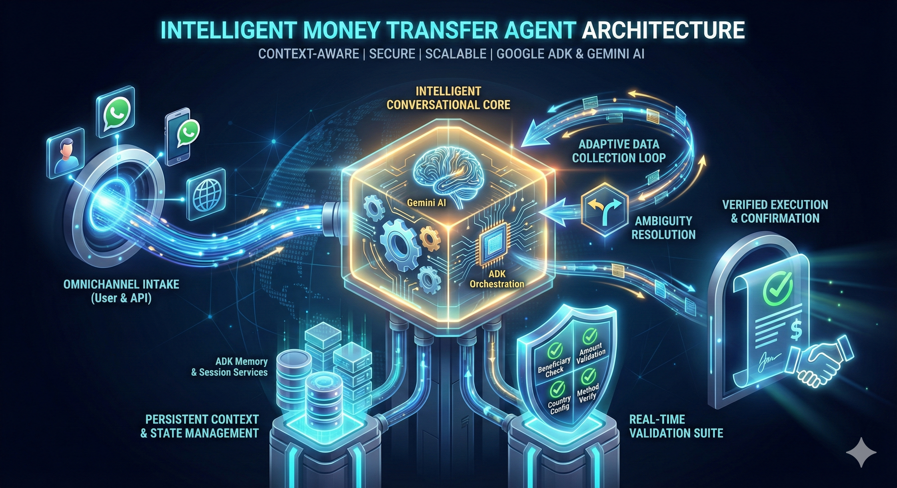
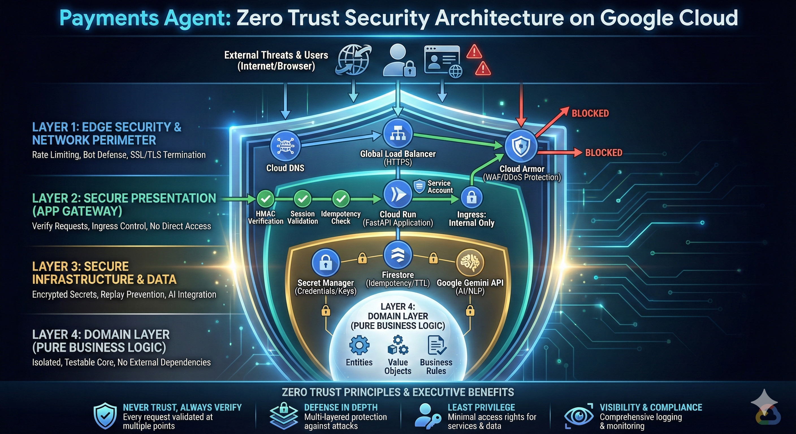
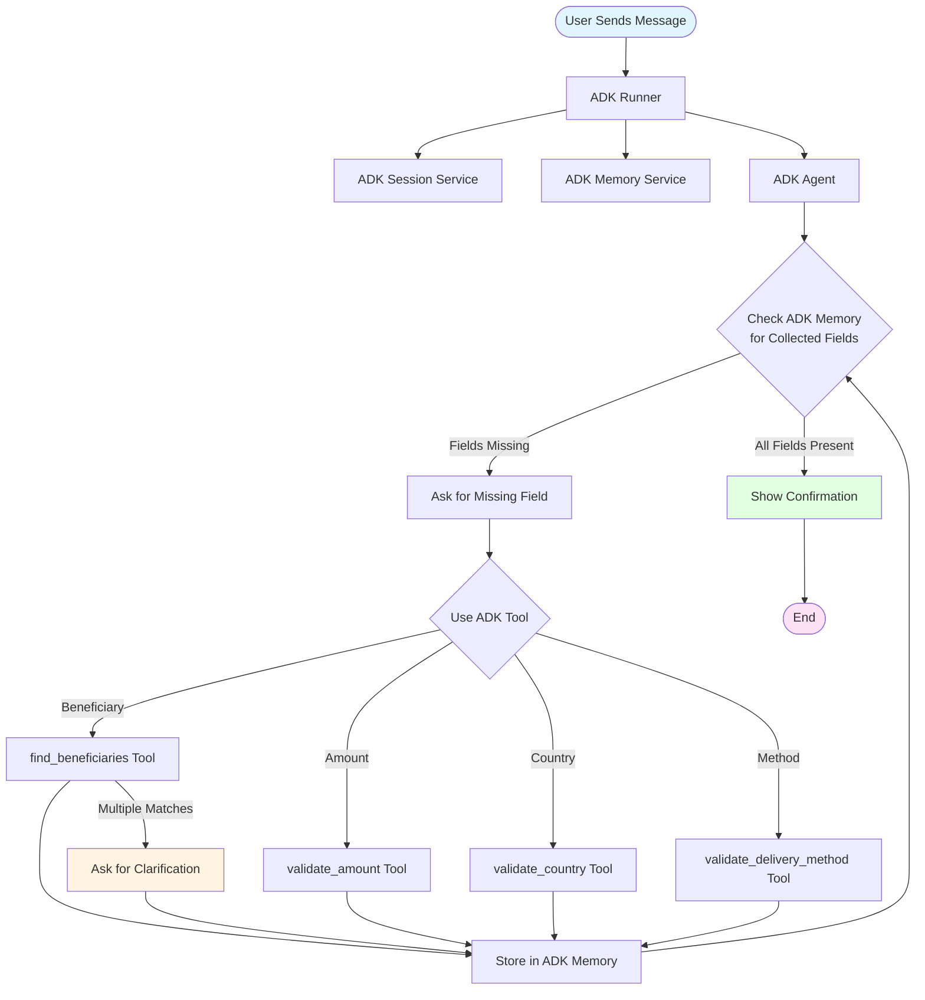

# Send Money Conversational Agent - Complete Guide

## Executive Summary

The Send Money Conversational Agent is an enterprise-grade conversational AI system designed for secure money transfer operations. Built on Google's Agent Development Kit (ADK) and deployed on Google Cloud Platform, it provides a robust, scalable, and secure solution for processing money transfer requests through natural language conversations.

### System Architecture Overview

The system follows a multi-layered architecture approach, combining Clean Architecture principles with Google ADK for intelligent conversation orchestration:



**Key Architectural Components:**

1. **ADK-Based Orchestration**: The system leverages Google ADK for:
   - Natural language understanding via Gemini API
   - Intelligent conversation flow management
   - Automatic state management and caching
   - Tool-based validation and data extraction

2. **Clean Architecture Layers**:
   - **Domain Layer**: Core business logic and entities
   - **Infrastructure Layer**: ADK integration, external services, and validators
   - **Presentation Layer**: FastAPI HTTP endpoints for WhatsApp webhook integration

3. **Cloud Infrastructure**: Deployed on Google Cloud Platform with enterprise-grade security:



**Infrastructure Highlights:**

- **Multi-Environment Setup**: Separate DEV and PRD projects for safe development and production workflows
- **Cloud Armor Protection**: DDoS protection with rate limiting and adaptive protection
- **CI/CD Pipeline**: Automated deployment via GitHub Actions with Workload Identity Federation
- **High Availability**: Cloud Run services with automatic scaling
- **Security**: Secret Manager integration, IAM-based authentication, and network-level protection

### Key Features

- **Intelligent Conversation Management**: Uses Google ADK Agents for natural conversation flow
- **Intent Recognition**: Gemini-powered natural language understanding
- **Adaptive Slot Filling**: Smart questioning to collect required information
- **Ambiguity Resolution**: Handles cases where user input matches multiple beneficiaries
- **State Management**: ADK Memory Service manages conversation state automatically
- **Caching**: Intelligent caching of validation results and beneficiary data
- **High Performance**: Designed for 1000 requests per minute with async architecture
- **WhatsApp Integration**: Webhook endpoint for WhatsApp Business API
- **Enterprise Security**: Cloud Armor DDoS protection, rate limiting, and adaptive protection

### Performance & Scalability

- **Throughput**: 1000 requests per minute (~17 req/sec)
- **Concurrency**: Fully async/await architecture
- **Caching**: Multi-level caching for optimal performance
- **Auto-scaling**: Cloud Run automatic scaling based on demand

---

## Table of Contents

1. [Project Overview](#project-overview)
2. [Architecture](#architecture)
3. [Conversation Flow](#conversation-flow)
4. [Local Development](#local-development)
5. [Deployment Guide](#deployment-guide)
6. [Cloud Armor Protection](#cloud-armor-protection)
7. [Configuration](#configuration)
8. [API Reference](#api-reference)
9. [Testing](#testing)
10. [Troubleshooting](#troubleshooting)

---

## Project Overview

A conversational agent for money transfers built with Clean Architecture, SOLID principles, and TDD. Uses Google ADK (Agent Development Kit) for orchestration, natural language understanding, state management, and caching.

### Technology Stack

- **Framework**: FastAPI (Python 3.11+)
- **AI/ML**: Google ADK with Gemini API
- **Cloud Platform**: Google Cloud Platform
- **Containerization**: Docker
- **Infrastructure as Code**: Terraform
- **CI/CD**: GitHub Actions with Workload Identity Federation
- **Package Management**: uv

---

## Architecture

The system follows Clean Architecture with four layers, fully integrated with Google ADK:

### Layer Structure

```
payments_agent/
├── src/
│   ├── domain/          # Domain layer - Core business logic, entities, value objects
│   ├── application/     # Application layer (Replaced by ADK Agents and Tools)
│   ├── infrastructure/   # Infrastructure layer
│   │   ├── adk/         # ADK Orchestrator, Tools, Memory Service, Session Service
│   │   ├── validators/  # External validation services
│   │   └── clients/     # HTTP clients
│   └── presentation/     # Presentation layer - FastAPI HTTP layer
├── tests/               # Test suite
├── docker/              # Dockerfiles
├── infrastructure/      # Terraform configurations
└── main.py             # FastAPI application entry point
```

### ADK Integration

- **Orchestration**: ADK Agent handles conversation flow
- **State Management**: ADK Memory Service stores conversation state
- **Caching**: ADK Memory Service caches tool results automatically
- **Session Management**: ADK Session Service manages user sessions with automatic cleanup
- **Tools**: All validators wrapped as ADK FunctionTools
- **Plugins**: LoggingPlugin and ReflectAndRetryToolPlugin for observability and reliability

### Infrastructure Components

1. **ADK Orchestrator**: Main conversation orchestration using ADK Agents
2. **ADK Tools**: Wrapped validators as ADK FunctionTools:
   - `find_beneficiaries`: Search and validate beneficiaries
   - `validate_amount`: Validate monetary amounts
   - `validate_country`: Validate destination countries
   - `validate_delivery_method`: Validate delivery methods
3. **ADK Memory Service**: State management and caching
4. **ADK Session Service**: Session management with TTL-based cleanup
5. **ADK Plugins**: Logging and automatic retry for tool failures

---

## Conversation Flow

The following flowchart illustrates how the agent processes user messages and manages the conversation:



### Flow Explanation

1. **Message Reception**: User sends a message via WhatsApp webhook
2. **Session Management**: Agent retrieves or creates a session for the user via ADK Session Service
3. **State Check**: Agent checks current conversation state using ADK Memory Service
4. **Intent Recognition** (IDLE state): Uses Gemini API via ADK to recognize "send_money" intent and extract initial entities
5. **Slot Filling** (COLLECTING state): Validates and extracts entities from user input using ADK Tools:
   - **Beneficiary**: Checks for ambiguity (multiple matches trigger clarification)
   - **Amount**: Validates monetary amount
   - **Country**: Validates destination country
   - **Delivery Method**: Validates delivery method
6. **Ambiguity Resolution**: If multiple matches found (e.g., "John" matches "John Doe" and "John Smith"), agent transitions to CLARIFYING state and asks user to select
7. **Adaptive Questioning**: Agent asks only for missing required fields
8. **Validation**: Once all fields are collected, validates the complete transfer request
9. **Confirmation**: Generates structured JSON summary and sends confirmation message

---

## Local Development

### Prerequisites

- Python 3.11+
- uv (package manager)
- Docker (optional, for containerization)
- Terraform (optional, for GCP deployment)
- Google Cloud SDK (optional, for GCP deployment)

### Setup

1. **Install dependencies**:
   ```bash
   uv pip install -e ".[dev]"
   ```

2. **Set up environment variables** (create `.env` file):
   ```bash
   GOOGLE_API_KEY=your-google-api-key
   META_APP_SECRET=chave-ficticia-123  # Temporary secret for demo
   DEMO_ACCESS_CODE=WPP-DEMO  # Access code for demo requests
   GCP_PROJECT_ID=your-project-id  # Optional, required for Firestore idempotency
   
   # ADK Retry Configuration (optional, defaults shown)
   ADK_MAX_RETRIES=5
   ADK_INITIAL_BACKOFF_SECONDS=0.5
   ADK_MAX_BACKOFF_SECONDS=32.0
   ADK_BACKOFF_MULTIPLIER=2.0
   ADK_ENABLE_RETRY=true
   ```

3. **Run the application**:
   ```bash
   python main.py
   ```
   
   Or with uvicorn:
   ```bash
   uvicorn main:app --reload
   ```

4. **Run tests**:
   ```bash
   pytest
   ```

### Docker Development

1. **Set up environment variables** (create `.env` file in project root):
   ```bash
   GOOGLE_API_KEY=your-google-api-key
   META_APP_SECRET=chave-ficticia-123  # Temporary secret for demo
   DEMO_ACCESS_CODE=WPP-DEMO  # Access code for demo requests
   GCP_PROJECT_ID=your-project-id  # Optional, required for Firestore idempotency
   
   # ADK Retry Configuration (optional, defaults shown)
   ADK_MAX_RETRIES=5
   ADK_INITIAL_BACKOFF_SECONDS=0.5
   ADK_MAX_BACKOFF_SECONDS=32.0
   ADK_BACKOFF_MULTIPLIER=2.0
   ADK_ENABLE_RETRY=true
   ```

2. **Build and run with Docker Compose**:
   ```bash
   docker-compose up --build
   ```

3. **Access the API**:
   - API: http://localhost:8000
   - Demo UI: http://localhost:8000/demo/
   - Health check: http://localhost:8000/health
   - API docs: http://localhost:8000/docs

---

## Deployment Guide

### Multi-Project CI/CD Setup

This guide provides step-by-step instructions for setting up the CI/CD pipeline with GitHub Actions and Google Cloud Platform.

#### Architecture Overview

- **DEV Project**: `<YOUR_PROJECT_ID>-dev` - Development environment
- **PRD Project**: `<YOUR_PROJECT_ID>` - Production environment
- **Build Strategy**: Build Once - Images built in PRD project, shared with DEV via cross-project IAM
- **Terraform State**: Separate GCS buckets per project for state isolation
- **Cloud Armor**: DDoS protection with rate limiting and adaptive protection

#### Prerequisites

1. **Google Cloud SDK** installed and authenticated
   ```bash
   gcloud --version
   gcloud auth list
   ```

2. **Access to both GCP projects**
   - `<YOUR_PROJECT_ID>-dev` (DEV project)
   - `<YOUR_PROJECT_ID>` (PRD project)

3. **GitHub repository** with Actions enabled

4. **Required permissions** in both GCP projects:
   - Project Owner or Editor
   - Service Account Admin
   - IAM Admin

### Bootstrap Scripts Execution Order

⚠️ **IMPORTANT**: Execute scripts in this exact order. GCS buckets MUST be created first.

#### Phase 1: Prerequisites (MUST BE FIRST)

##### 1. Create Terraform State Buckets

```bash
./scripts/bootstrap-terraform-state.sh
```

**What it does:**
- Creates GCS buckets for Terraform state in both projects
- Enables versioning
- Sets uniform bucket-level access

**Output:**
- Bucket names for `backend.conf` files
- Verify buckets exist before proceeding

**Verification:**
```bash
gcloud storage buckets list --project=<YOUR_PROJECT_ID>-dev | grep tf-state
gcloud storage buckets list --project=<YOUR_PROJECT_ID> | grep tf-state
```

#### Phase 2: Infrastructure Setup

##### 2. Set up Workload Identity Federation for DEV

```bash
./scripts/bootstrap-wif-dev.sh <GITHUB_OWNER> <GITHUB_REPO>
```

**Example:**
```bash
./scripts/bootstrap-wif-dev.sh myorg payments_agent
```

**What it does:**
- Creates Workload Identity Pool
- Creates GitHub OIDC provider
- Creates Service Account for GitHub Actions
- Grants necessary IAM roles

**Output:**
- `WIF_PROVIDER_DEV` - Add to GitHub Secrets
- `WIF_SA_DEV` - Add to GitHub Secrets

##### 3. Set up Workload Identity Federation for PRD

```bash
./scripts/bootstrap-wif-prd.sh <GITHUB_OWNER> <GITHUB_REPO>
```

**Example:**
```bash
./scripts/bootstrap-wif-prd.sh myorg payments_agent
```

**What it does:**
- Same as DEV, but for PRD project
- Includes Artifact Registry Writer role

**Output:**
- `WIF_PROVIDER_PRD` - Add to GitHub Secrets
- `WIF_SA_PRD` - Add to GitHub Secrets

##### 4. Create Artifact Registry

```bash
./scripts/bootstrap-artifact-registry.sh
```

**What it does:**
- Creates Docker repository in PRD project
- Configures repository settings

**Output:**
- Repository name and region
- Add to GitHub Environment Variables

#### Phase 3: GitHub Configuration

##### 5. Collect and Format GitHub Values

```bash
./scripts/setup-github-env-vars.sh
```

**What it does:**
- Collects all generated values from bootstrap scripts
- Formats them for GitHub configuration

**Output:**
- Complete list of Environment Variables and Secrets
- Instructions for GitHub configuration

##### 6. Configure GitHub Repository

1. Go to your GitHub repository
2. Navigate to: **Settings > Environments**
3. Create/Edit **dev** environment:
   - Add all `DEV_*` Environment Variables (non-sensitive)
   - Add all DEV Secrets (WIF_PROVIDER_DEV, WIF_SA_DEV, DEV_GOOGLE_API_KEY, DEV_META_APP_SECRET, DEV_DEMO_ACCESS_CODE)
4. Create/Edit **prd** environment:
   - Add all `PRD_*` Environment Variables (non-sensitive)
   - Add all PRD Secrets (WIF_PROVIDER_PRD, WIF_SA_PRD, PRD_GOOGLE_API_KEY, PRD_META_APP_SECRET, PRD_DEMO_ACCESS_CODE)
5. Set shared variables at repository level (optional):
   - `ARTIFACT_REGION`
   - `ARTIFACT_REPO_NAME`

**GitHub Environment Variables (DEV):**
- `DEV_GCP_PROJECT_ID` = `<YOUR_PROJECT_ID>-dev`
- `DEV_GCP_REGION` = `us-central1` (or your preferred region)
- `DEV_GEMINI_MODEL` = `gemini-2.5-flash-lite` (or your preferred model)
- `DEV_LOG_LEVEL` = `INFO`
- `DEV_SESSION_TTL_MINUTES` = `30`
- `DEV_CACHE_TTL_INTENT_HOURS` = `1`
- `DEV_CACHE_TTL_BENEFICIARY_MINUTES` = `30`
- `DEV_CACHE_TTL_VALIDATION_HOURS` = `1`
- `DEV_ADK_MAX_RETRIES` = `5` (Maximum retry attempts for ADK API calls - REQUIRED)
- `DEV_ADK_INITIAL_BACKOFF_SECONDS` = `0.5` (Initial delay before first retry - REQUIRED)
- `DEV_ADK_MAX_BACKOFF_SECONDS` = `32.0` (Maximum delay between retries - REQUIRED)
- `DEV_ADK_BACKOFF_MULTIPLIER` = `2.0` (Exponential backoff multiplier - REQUIRED)
- `DEV_ADK_ENABLE_RETRY` = `true` (Enable/disable retry mechanism - REQUIRED)

**GitHub Secrets (DEV):**
- `WIF_PROVIDER_DEV` = (output from `bootstrap-wif-dev.sh` script)
- `WIF_SA_DEV` = (output from `bootstrap-wif-dev.sh` script)
- `DEV_GOOGLE_API_KEY` = (your Google API key for DEV environment)
- `DEV_META_APP_SECRET` = (temporary secret for demo, e.g., "chave-ficticia-123")
- `DEV_DEMO_ACCESS_CODE` = (access code for demo requests, e.g., "WPP-DEMO")

**GitHub Environment Variables (PRD):**
- `PRD_GCP_PROJECT_ID` = `<YOUR_PROJECT_ID>`
- `PRD_GCP_REGION` = `us-central1` (or your preferred region)
- `PRD_GEMINI_MODEL` = `gemini-2.5-flash` (or your preferred model)
- `PRD_LOG_LEVEL` = `INFO`
- `PRD_SESSION_TTL_MINUTES` = `30`
- `PRD_CACHE_TTL_INTENT_HOURS` = `1`
- `PRD_CACHE_TTL_BENEFICIARY_MINUTES` = `30`
- `PRD_CACHE_TTL_VALIDATION_HOURS` = `1`
- `PRD_ADK_MAX_RETRIES` = `5` (Maximum retry attempts for ADK API calls - REQUIRED)
- `PRD_ADK_INITIAL_BACKOFF_SECONDS` = `0.5` (Initial delay before first retry - REQUIRED)
- `PRD_ADK_MAX_BACKOFF_SECONDS` = `32.0` (Maximum delay between retries - REQUIRED)
- `PRD_ADK_BACKOFF_MULTIPLIER` = `2.0` (Exponential backoff multiplier - REQUIRED)
- `PRD_ADK_ENABLE_RETRY` = `true` (Enable/disable retry mechanism - REQUIRED)

**GitHub Secrets (PRD):**
- `WIF_PROVIDER_PRD` = (output from `bootstrap-wif-prd.sh` script)
- `WIF_SA_PRD` = (output from `bootstrap-wif-prd.sh` script)
- `PRD_GOOGLE_API_KEY` = (your Google API key for PRD environment)
- `PRD_META_APP_SECRET` = (real Meta webhook secret from Facebook Developer Console)
- `PRD_DEMO_ACCESS_CODE` = (access code for demo requests, optional for PRD)

#### Phase 4: First Terraform Deployment

##### 7. Initial Terraform Deployment

**DEV Deployment:**
```bash
cd infrastructure/terraform
terraform init -backend-config=environments/dev/backend.conf
terraform plan -var-file=environments/dev/terraform.tfvars
terraform apply -var-file=environments/dev/terraform.tfvars
```

**PRD Deployment:**
```bash
terraform init -backend-config=environments/prd/backend.conf
terraform plan -var-file=environments/prd/terraform.tfvars
terraform apply -var-file=environments/prd/terraform.tfvars
```

**Note:** For the first deployment via GitHub Actions, the `image` variable is automatically provided by the workflow. For manual deployment, you'll need to provide it:
```bash
terraform apply -var-file=environments/dev/terraform.tfvars \
  -var="image=<REGION>-docker.pkg.dev/<PRD_PROJECT_ID>/<REPO_NAME>/agent:latest"
```

#### Phase 5: Cross-Project IAM Setup

##### 8. Set up Cross-Project IAM

```bash
./scripts/bootstrap-cross-project-iam.sh
```

**What it does:**
- Grants DEV Cloud Run Service Account access to PRD Artifact Registry
- Enables DEV to pull images from PRD

**When to run:** After first `terraform apply` creates the Cloud Run Service Account

**Verification:**
```bash
gcloud artifacts repositories get-iam-policy <REPO_NAME> \
  --location=<REGION> \
  --project=<PRD_PROJECT_ID>
```

### Workflow Triggers

- **DEV**: Automatic deployment on every commit to `develop` branch
- **PRD**: Automatic deployment when a pull request is merged to `main` branch

### Testing the Setup

#### Test DEV Deployment

1. Make a test commit to `develop` branch:
   ```bash
   git checkout develop
   git commit --allow-empty -m "test: trigger DEV deployment"
   git push origin develop
   ```

2. Monitor GitHub Actions workflow
3. Verify:
   - Image is built and pushed to Artifact Registry
   - DEV deployment succeeds
   - Service is accessible

#### Test PRD Deployment

1. Create a pull request to `main` branch
2. Merge the pull request
3. Monitor GitHub Actions workflow
4. Verify:
   - Image is built and pushed to Artifact Registry
   - PRD deployment succeeds
   - Service is accessible

### Manual Commands Reference

#### Enable Required APIs

```bash
# DEV project
gcloud config set project <YOUR_PROJECT_ID>-dev
gcloud services enable iamcredentials.googleapis.com
gcloud services enable artifactregistry.googleapis.com
gcloud services enable secretmanager.googleapis.com
gcloud services enable run.googleapis.com
gcloud services enable cloudbuild.googleapis.com
gcloud services enable compute.googleapis.com  # For Cloud Armor

# PRD project
gcloud config set project <YOUR_PROJECT_ID>
gcloud services enable iamcredentials.googleapis.com
gcloud services enable artifactregistry.googleapis.com
gcloud services enable secretmanager.googleapis.com
gcloud services enable run.googleapis.com
gcloud services enable cloudbuild.googleapis.com
gcloud services enable compute.googleapis.com  # For Cloud Armor
```

#### Verify Setup

```bash
# Check Workload Identity Pools
gcloud iam workload-identity-pools list --location=global --project=<YOUR_PROJECT_ID>-dev
gcloud iam workload-identity-pools list --location=global --project=<YOUR_PROJECT_ID>

# Check Service Accounts
gcloud iam service-accounts list --project=<YOUR_PROJECT_ID>-dev
gcloud iam service-accounts list --project=<YOUR_PROJECT_ID>

# Check Artifact Registry
gcloud artifacts repositories list --project=<YOUR_PROJECT_ID>

# Check Terraform State Buckets
gcloud storage buckets list --project=<YOUR_PROJECT_ID>-dev | grep tf-state
gcloud storage buckets list --project=<YOUR_PROJECT_ID> | grep tf-state
```

### Setting Secret Manager Values

**Important:** After Terraform creates the secrets in Secret Manager, you need to populate them with actual values. This is typically done via GitHub Actions workflow or manually:

**Manual method (one-time setup):**
```bash
# DEV project
gcloud config set project <YOUR_PROJECT_ID>-dev
echo -n "chave-ficticia-123" | gcloud secrets versions add payments-agent-meta-app-secret --data-file=-
echo -n "WPP-DEMO" | gcloud secrets versions add payments-agent-demo-access-code --data-file=-

# PRD project (use real Meta secret)
gcloud config set project <YOUR_PROJECT_ID>
echo -n "<REAL_META_SECRET>" | gcloud secrets versions add payments-agent-meta-app-secret --data-file=-
echo -n "<PRD_DEMO_ACCESS_CODE>" | gcloud secrets versions add payments-agent-demo-access-code --data-file=-
```

**Note:** The GitHub Actions workflow should be configured to automatically update these secrets from GitHub Secrets during deployment. Ensure your workflow includes steps to:
1. Read `DEV_META_APP_SECRET` / `PRD_META_APP_SECRET` from GitHub Secrets
2. Read `DEV_DEMO_ACCESS_CODE` / `PRD_DEMO_ACCESS_CODE` from GitHub Secrets
3. Update the corresponding secrets in GCP Secret Manager using `gcloud secrets versions add`:
   ```bash
   echo -n "${{ secrets.DEV_META_APP_SECRET }}" | \
     gcloud secrets versions add payments-agent-meta-app-secret --data-file=-
   echo -n "${{ secrets.DEV_DEMO_ACCESS_CODE }}" | \
     gcloud secrets versions add payments-agent-demo-access-code --data-file=-
   ```

### Security Best Practices

1. **Never commit** `.tfvars` files with actual values
2. **Use Workload Identity Federation** (no service account keys)
3. **Rotate secrets** regularly in Secret Manager
4. **Use least-privilege IAM roles** for service accounts
5. **Enable secret versioning** in Secret Manager
6. **Isolate state files** per project (separate GCS buckets)
7. **Limit cross-project access** to read-only for Artifact Registry
8. **Require manual approval** for PRD deployments via GitHub Environments

---

## Cloud Armor Protection

### Overview

Cloud Armor has been configured to protect both DEV and PRD environments against DDoS attacks and other types of attacks.

### Architecture

```
Internet → Load Balancer → Cloud Armor Security Policy → Backend Service → Cloud Run
```

#### Components

1. **Load Balancer HTTP(S)**: Receives all traffic
2. **Cloud Armor Security Policy**: Applies security rules
3. **Backend Service**: Routes traffic to Cloud Run
4. **Cloud Run**: Application

### Protections Implemented

#### 1. Rate Limiting (DDoS Protection)

- **DEV**: 200 requests per minute per IP
- **PRD**: 100 requests per minute per IP

When the limit is exceeded:
- Returns HTTP 429 (Too Many Requests)
- IP is temporarily blocked

#### 2. Adaptive Protection (PRD only)

- **Layer 7 DDoS Defense**: Automatic protection against Layer 7 DDoS attacks
- **Machine Learning**: Automatically detects attack patterns
- **Cost**: Enabled only in PRD to save costs in DEV

#### 3. IP Allow/Block Lists (Optional)

- **Allowed IPs**: IPs that can bypass rate limiting
- **Blocked IPs**: IPs permanently blocked

### Configuration by Environment

#### DEV (Development)

```hcl
cloud_armor_enable = true
cloud_armor_rate_limit_requests = 200
cloud_armor_rate_limit_interval = 60
cloud_armor_enable_adaptive_protection = false  # Disabled to save costs
cloud_armor_enable_ssl = false
```

**Characteristics:**
- More permissive limits (200 req/min)
- Adaptive Protection disabled
- Focus on development and testing

#### PRD (Production)

```hcl
cloud_armor_enable = true
cloud_armor_rate_limit_requests = 100
cloud_armor_rate_limit_interval = 60
cloud_armor_enable_adaptive_protection = true  # Enabled for maximum protection
cloud_armor_enable_ssl = false  # Configure if you have SSL certificate
```

**Characteristics:**
- More restrictive limits (100 req/min)
- Adaptive Protection enabled
- Maximum protection against DDoS

### Access URLs

#### Cloud Run Direct (NOT Protected)

```
https://<SERVICE_NAME>-xxxxx-<REGION>.a.run.app
```

⚠️ **Do not use in production!** This URL does not pass through Cloud Armor.

#### Load Balancer (PROTECTED - Use this!)

```
http://<LOAD_BALANCER_IP>
```

✅ **Use this URL in production!** All traffic passes through Cloud Armor.

To get the Load Balancer IP:
```bash
terraform output load_balancer_ip
```

### Advanced Configuration

#### Block Specific IPs

Add to `terraform.tfvars`:

```hcl
cloud_armor_blocked_ips = [
  "<IP_ADDRESS>/32",      # Example: "192.168.1.100/32"
  "<CIDR_BLOCK>"          # Example: "10.0.0.0/24"
]
```

#### Allow Specific IPs (Bypass Rate Limit)

Add to `terraform.tfvars`:

```hcl
cloud_armor_allowed_ips = [
  "<IP_ADDRESS>/32"  # Example: "203.0.113.0/32" (Your company IP)
]
```

#### Enable SSL/HTTPS

1. Create an SSL certificate in GCP:
   ```bash
   gcloud compute ssl-certificates create <CERT_NAME> \
     --domains=<YOUR_DOMAIN> \
     --global
   ```

2. Update `terraform.tfvars`:
   ```hcl
   cloud_armor_enable_ssl = true
   cloud_armor_ssl_certificate_id = "<CERT_NAME>"
   ```

3. Configure DNS to point to Load Balancer IP

#### Enable CDN

To cache static content:

```hcl
cloud_armor_enable_cdn = true
```

### Monitoring

#### Cloud Armor Logs

Access: https://console.cloud.google.com/logs/query

Useful filters:
```
resource.type="http_load_balancer"
jsonPayload.enforcedSecurityPolicy.name="<SERVICE_NAME>-armor-policy-<ENVIRONMENT>"
```

#### Metrics

Access: https://console.cloud.google.com/monitoring

Important metrics:
- `loadbalancing.googleapis.com/https/request_count`
- `loadbalancing.googleapis.com/https/backend_request_count`
- `loadbalancing.googleapis.com/https/response_code_count`

### Costs

#### Cloud Armor

- **Security Policies**: $5/month per policy
- **Rules**: $1/month per rule (first 5 rules are free)
- **Adaptive Protection**: $3,000/month (enabled only in PRD)

#### Load Balancer

- **Forwarding Rules**: $18/month per rule
- **Backend Service**: Free
- **Egress**: $0.12/GB (first 10GB/month free)

**Monthly estimate:**
- **DEV**: ~$25/month (without Adaptive Protection)
- **PRD**: ~$3,025/month (with Adaptive Protection)

### Recommendations

1. **Always use the Load Balancer URL** in production (not Cloud Run direct)
2. **Configure SSL/HTTPS** for production
3. **Monitor logs** regularly to detect attacks
4. **Adjust rate limits** based on real traffic
5. **Use Adaptive Protection** only in PRD (saves costs)

### Next Steps

1. Configure DNS to point to Load Balancer IP
2. Configure SSL certificate if necessary
3. Monitor metrics and adjust configurations
4. Review logs regularly to detect attack patterns

---

## Configuration

### Environment Variables

The application uses the following environment variables, which are configured via Terraform and GitHub Actions:

#### Application Variables

- `GOOGLE_API_KEY`: Google Gemini API key (required, stored in Secret Manager)
- `ENVIRONMENT`: Environment name (dev/prd, set via Terraform)
- `GCP_PROJECT_ID`: GCP Project ID (set via Terraform)
- `LOG_LEVEL`: Logging level (INFO/DEBUG/ERROR, configurable per environment)
- `GEMINI_MODEL`: Gemini model name (configurable per environment)

#### Cache Configuration

- `SESSION_TTL_MINUTES`: Session TTL in minutes (default: 30, configurable per environment)
- `CACHE_TTL_INTENT_HOURS`: Intent cache TTL in hours (default: 1, configurable per environment)
- `CACHE_TTL_BENEFICIARY_MINUTES`: Beneficiary cache TTL in minutes (default: 30, configurable per environment)
- `CACHE_TTL_VALIDATION_HOURS`: Validation cache TTL in hours (default: 1, configurable per environment)

#### Server Configuration

- `HOST`: Server host (default: 0.0.0.0)
- `PORT`: Server port (default: 8000)

#### ADK Retry Configuration

- `ADK_MAX_RETRIES`: Maximum number of retry attempts (default: 5)
- `ADK_INITIAL_BACKOFF_SECONDS`: Initial delay before first retry in seconds (default: 0.5)
- `ADK_MAX_BACKOFF_SECONDS`: Maximum delay between retries in seconds (default: 32.0)
- `ADK_BACKOFF_MULTIPLIER`: Exponential backoff multiplier (default: 2.0)
- `ADK_ENABLE_RETRY`: Enable/disable retry mechanism (default: true)

See the "Error Handling and Retry Mechanism" section for detailed information.

### GitHub Environment Variables

Configuration values are managed via GitHub Environment Variables (preferred) and Secrets (sensitive data only). See the Deployment Guide section for the complete list of required variables.

---

## API Reference

### Health Check

```
GET /health
```

Returns service health status.

### WhatsApp Webhook

```
POST /webhook/whatsapp
Content-Type: application/json

{
  "from_number": "+1234567890",
  "message": "I want to send $100 to John",
  "message_id": "msg_123",
  "timestamp": "2024-01-01T00:00:00Z"
}
```

**Response:**
```json
{
  "response": "I'll help you send $100 to John. Can you confirm the destination country?",
  "session_id": "session_123"
}
```

### Demo UI

Access the demo interface at:
```
http://localhost:8000/demo/
```

### API Documentation

Interactive API documentation available at:
```
http://localhost:8000/docs
```

---

## Testing

The project follows TDD (Test-Driven Development). Run tests with:

```bash
pytest
```

For coverage:
```bash
pytest --cov=src --cov-report=html
```

### Test Structure

- **Unit Tests**: Test individual components in isolation
- **Integration Tests**: Test component interactions
- **End-to-End Tests**: Test complete conversation flows

---

## Troubleshooting

### Terraform Backend Error

**Problem:** `Error: Failed to get existing workspaces`

**Solution:** Ensure GCS buckets exist before running `terraform init`:
```bash
./scripts/bootstrap-terraform-state.sh
```

### Workload Identity Authentication Error

**Problem:** `Error: failed to get credentials`

**Solution:** Verify WIF configuration:
1. Check GitHub Secrets are set correctly
2. Verify service account has correct IAM roles
3. Check attribute condition matches repository name

### Image Pull Error in DEV

**Problem:** `Error: failed to pull image`

**Solution:** Run cross-project IAM setup:
```bash
./scripts/bootstrap-cross-project-iam.sh
```

### Secret Manager Access Error

**Problem:** `Error: Permission denied on secret`

**Solution:** Verify service account has `roles/secretmanager.admin`:
```bash
gcloud projects get-iam-policy <YOUR_PROJECT_ID>-dev \
  --flatten="bindings[].members" \
  --filter="bindings.members:github-actions-sa@*"
```

### Cloud Armor Issues

#### Error 429 (Too Many Requests)

**Cause:** Rate limit exceeded (usually from Cloud Armor or Google ADK API)

**Common Scenarios:**
1. **Cloud Armor Rate Limiting**: During long conversations, each user message counts as a request. If you send many messages quickly, you may hit the rate limit.
2. **Google ADK/Gemini API Rate Limiting**: The API itself may have rate limits.

**Solution:**
1. **Wait a moment** before sending another message (rate limits reset after the interval)
2. **For Development**: Increase `cloud_armor_rate_limit_requests` in `terraform.tfvars` (default: 500 for DEV, 100 for PRD)
3. **For Production**: Consider using session-based rate limiting or increasing limits based on expected conversation length
4. **Add your IP** to `cloud_armor_allowed_ips` in `terraform.tfvars` to bypass rate limiting (development only)
5. **Check logs** to identify if the 429 is from Cloud Armor (before application) or from the API (during processing)

**Note**: The system now automatically retries 429 errors from the Google ADK API with exponential backoff. However, 429 errors from Cloud Armor (which occur before the request reaches the application) cannot be retried automatically and require waiting or adjusting limits.

#### Load Balancer Not Responding

**Verification:**
```bash
# Check if Load Balancer was created
gcloud compute forwarding-rules list --global

# Check IP
terraform output load_balancer_ip

# Test connectivity
curl -v http://$(terraform output -raw load_balancer_ip)
```

#### Cloud Armor Blocking Legitimate Traffic

**Solution:**
1. Check Cloud Armor logs
2. Adjust rate limits if necessary
3. Add legitimate IPs to `cloud_armor_allowed_ips`

---

## Performance

The system is designed to handle:
- **1000 requests per minute** (~17 req/sec)
- Async/await throughout for concurrent handling
- In-memory caching for performance
- Connection pooling for external APIs

---

## License

MIT

---

## Additional Resources

- [Google ADK Documentation](https://cloud.google.com/adk)
- [Google Cloud Run Documentation](https://cloud.google.com/run/docs)
- [Cloud Armor Documentation](https://cloud.google.com/armor/docs)
- [Terraform GCP Provider](https://registry.terraform.io/providers/hashicorp/google/latest/docs)

