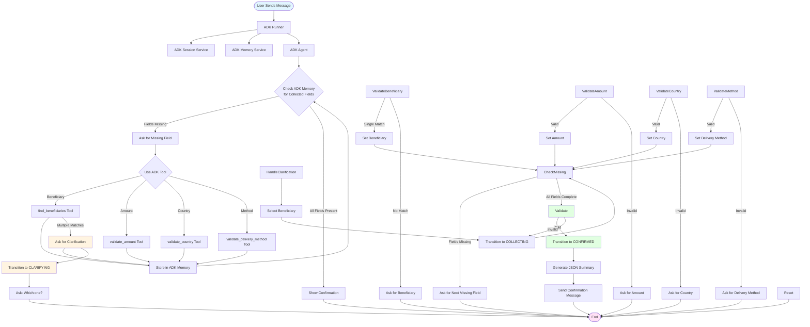

# Send Money Conversational Agent

A conversational agent for money transfers built with Clean Architecture, SOLID principles, and TDD. Uses Google ADK (Agent Development Kit) for orchestration, natural language understanding, state management, and caching.

## Features

- **ADK-Based Architecture**: Fully powered by Google ADK framework
  - **ADK Agents**: Conversational orchestration with natural language understanding
  - **ADK Tools**: Validation tools for beneficiary, amount, country, and delivery method
  - **ADK Memory Service**: State management and caching
  - **ADK Session Service**: Session management with automatic cleanup
  - **ADK Plugins**: Logging and automatic retry for tool failures
- **Intent Recognition**: Uses Gemini API via ADK for natural language understanding
- **Slot Filling**: Adaptive questioning to collect required information
- **Ambiguity Resolution**: Handles cases where user input matches multiple beneficiaries
- **State Management**: ADK Memory Service manages conversation state
- **Caching**: ADK Memory Service handles caching automatically
- **Async Architecture**: Built for high concurrency (1000 req/min)
- **WhatsApp Integration**: Webhook endpoint for WhatsApp messages

## Architecture

The system follows Clean Architecture with four layers, fully integrated with Google ADK:

- **Domain**: Core business logic, entities, value objects
- **Application**: (Replaced by ADK Agents and Tools)
- **Infrastructure**: 
  - **ADK Orchestrator**: Main conversation orchestration using ADK Agents
  - **ADK Tools**: Wrapped validators as ADK FunctionTools
  - **ADK Memory Service**: State management and caching
  - **ADK Session Service**: Session management
  - **ADK Plugins**: Logging and retry plugins
  - External services (validators, HTTP clients)
- **Presentation**: FastAPI HTTP layer + AgentFlow orchestrator (async)

### ADK Integration

- **Orchestration**: ADK Agent handles conversation flow
- **State Management**: ADK Memory Service stores conversation state
- **Caching**: ADK Memory Service caches tool results
- **Session Management**: ADK Session Service manages user sessions
- **Tools**: All validators wrapped as ADK FunctionTools
- **Plugins**: LoggingPlugin and ReflectAndRetryToolPlugin for observability and reliability

## Conversation Flow

The following flowchart illustrates how the agent processes user messages and manages the conversation:



### Flow Explanation

1. **Message Reception**: User sends a message via WhatsApp webhook
2. **Session Management**: Agent retrieves or creates a session for the user
3. **State Check**: Agent checks current conversation state (IDLE, COLLECTING, CLARIFYING, etc.)
4. **Intent Recognition** (IDLE state): Uses Gemini API to recognize "send_money" intent and extract initial entities
5. **Slot Filling** (COLLECTING state): Validates and extracts entities from user input:
   - Beneficiary: Checks for ambiguity (multiple matches trigger clarification)
   - Amount: Validates monetary amount
   - Country: Validates destination country
   - Delivery Method: Validates delivery method
6. **Ambiguity Resolution**: If multiple matches found (e.g., "John" matches "John Doe" and "John Smith"), agent transitions to CLARIFYING state and asks user to select
7. **Adaptive Questioning**: Agent asks only for missing required fields
8. **Validation**: Once all fields are collected, validates the complete transfer request
9. **Confirmation**: Generates structured JSON summary and sends confirmation message

## Project Structure

```
payments_agent/
├── src/
│   ├── domain/          # Domain layer
│   ├── application/     # Application layer
│   ├── infrastructure/   # Infrastructure layer
│   └── presentation/     # Presentation layer
├── tests/               # Test suite
├── docker/              # Dockerfiles
├── infrastructure/      # Terraform configurations
└── main.py             # FastAPI application entry point
```

## Setup

### Prerequisites

- Python 3.11+
- uv (package manager)
- Docker (optional, for containerization)
- Terraform (optional, for GCP deployment)
- Google Cloud SDK (optional, for GCP deployment)

### Local Development

1. **Install dependencies**:
   ```bash
   uv pip install -e ".[dev]"
   ```

2. **Set up environment variables**:
   ```bash
   cp .env.example .env
   # Edit .env and add your GOOGLE_API_KEY
   ```

3. **Run the application**:
   ```bash
   python main.py
   ```

   Or with uvicorn:
   ```bash
   uvicorn main:app --reload
   ```

4. **Run tests**:
   ```bash
   pytest
   ```

### Docker Development

1. **Build and run with Docker Compose**:
   ```bash
   docker-compose up --build
   ```

2. **Access the API**:
   - API: http://localhost:8000
   - Health check: http://localhost:8000/health
   - API docs: http://localhost:8000/docs

## API Endpoints

### Health Check
```
GET /health
```

### WhatsApp Webhook
```
POST /webhook/whatsapp
Content-Type: application/json

{
  "from_number": "+1234567890",
  "message": "I want to send $100 to John",
  "message_id": "msg_123",
  "timestamp": "2024-01-01T00:00:00Z"
}
```

## Deployment

### CI/CD with GitHub Actions

This project uses GitHub Actions for automated deployment to Google Cloud Platform with separate DEV and PRD environments.

#### Architecture

- **DEV Project**: `<YOUR_PROJECT_ID>-dev` - Automatic deployment on `develop` branch commits
- **PRD Project**: `<YOUR_PROJECT_ID>` - Automatic deployment on PR merge to `main` branch
- **Build Strategy**: Build Once - Images built in PRD project, shared with DEV via cross-project IAM
- **Terraform State**: Separate GCS buckets per project for state isolation
- **Cloud Armor**: DDoS protection with rate limiting (see [docs/CLOUD_ARMOR.md](docs/CLOUD_ARMOR.md))

#### Initial Setup

1. **Run Bootstrap Scripts** (one-time setup):
   ```bash
   # Phase 1: Create Terraform state buckets (MUST BE FIRST)
   ./scripts/bootstrap-terraform-state.sh
   
   # Phase 2: Set up Workload Identity Federation
   ./scripts/bootstrap-wif-dev.sh <GITHUB_OWNER> <GITHUB_REPO>
   ./scripts/bootstrap-wif-prd.sh <GITHUB_OWNER> <GITHUB_REPO>
   
   # Phase 3: Create Artifact Registry
   ./scripts/bootstrap-artifact-registry.sh
   
   # Phase 4: Collect GitHub configuration values
   ./scripts/setup-github-env-vars.sh
   ```

2. **Configure GitHub Repository**:
   - Go to **Settings > Environments**
   - Create `dev` and `prd` environments
   - Add Environment Variables and Secrets (see `docs/DEPLOYMENT.md` for complete list)

3. **First Terraform Deployment**:
   ```bash
   cd infrastructure/terraform
   terraform init -backend-config=environments/dev/backend.conf
   terraform apply -var-file=environments/dev/terraform.tfvars
   
   terraform init -backend-config=environments/prd/backend.conf
   terraform apply -var-file=environments/prd/terraform.tfvars
   ```

4. **Set up Cross-Project IAM**:
   ```bash
   ./scripts/bootstrap-cross-project-iam.sh
   ```

For detailed step-by-step instructions, see [DEPLOYMENT.md](docs/DEPLOYMENT.md).

#### Workflow Triggers

- **DEV**: Automatic deployment on every commit to `develop` branch
- **PRD**: Automatic deployment when a pull request is merged to `main` branch

#### Bootstrap Scripts

All bootstrap scripts are located in `scripts/` directory:

- `bootstrap-terraform-state.sh` - Creates GCS buckets for Terraform state
- `bootstrap-wif-dev.sh` - Sets up Workload Identity Federation for DEV
- `bootstrap-wif-prd.sh` - Sets up Workload Identity Federation for PRD
- `bootstrap-artifact-registry.sh` - Creates Artifact Registry repository
- `bootstrap-cross-project-iam.sh` - Sets up cross-project IAM for image sharing
- `setup-github-env-vars.sh` - Collects and formats values for GitHub configuration

### Cloud Armor Protection

The deployment includes Cloud Armor for DDoS protection:
- Rate limiting (configurable per environment)
- Adaptive Protection (PRD only, optional)
- IP filtering (optional)

See [docs/CLOUD_ARMOR.md](docs/CLOUD_ARMOR.md) for complete documentation.

**Important:** Always use the Load Balancer URL (protected by Cloud Armor) in production. Get it with:
```bash
terraform output load_balancer_url
```

### Manual Deployment (Legacy)

For manual deployment without CI/CD, see the [docs/DEPLOYMENT.md](docs/DEPLOYMENT.md) guide.

## Configuration

### Environment Variables

The application uses the following environment variables, which are configured via Terraform and GitHub Actions:

**Application Variables:**
- `GOOGLE_API_KEY`: Google Gemini API key (required, stored in Secret Manager)
- `ENVIRONMENT`: Environment name (dev/prd, set via Terraform)
- `GCP_PROJECT_ID`: GCP Project ID (set via Terraform)
- `LOG_LEVEL`: Logging level (INFO/DEBUG/ERROR, configurable per environment)
- `GEMINI_MODEL`: Gemini model name (configurable per environment)

**Cache Configuration:**
- `SESSION_TTL_MINUTES`: Session TTL in minutes (default: 30, configurable per environment)
- `CACHE_TTL_INTENT_HOURS`: Intent cache TTL in hours (default: 1, configurable per environment)
- `CACHE_TTL_BENEFICIARY_MINUTES`: Beneficiary cache TTL in minutes (default: 30, configurable per environment)
- `CACHE_TTL_VALIDATION_HOURS`: Validation cache TTL in hours (default: 1, configurable per environment)

**Server Configuration:**
- `HOST`: Server host (default: 0.0.0.0)
- `PORT`: Server port (default: 8000)

### GitHub Environment Variables

Configuration values are managed via GitHub Environment Variables (preferred) and Secrets (sensitive data only). See [DEPLOYMENT.md](docs/DEPLOYMENT.md) for the complete list of required variables.

## Testing

The project follows TDD (Test-Driven Development). Run tests with:

```bash
pytest
```

For coverage:
```bash
pytest --cov=src --cov-report=html
```

## Performance

The system is designed to handle:
- **1000 requests per minute** (~17 req/sec)
- Async/await throughout for concurrent handling
- In-memory caching for performance
- Connection pooling for external APIs

## License

MIT

